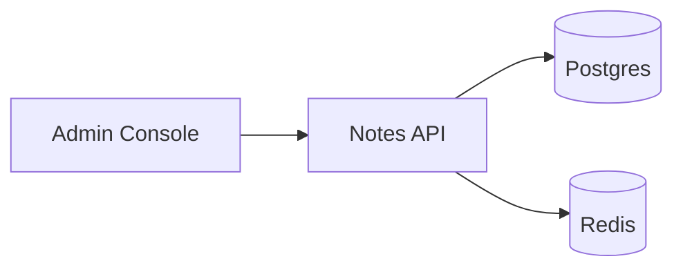

# C4 containers — Demo Platform

```mermaid
graph LR
  web[Admin Console] --> api[Notes API]
  api --> db[(Postgres)]
  api --> cache[(Redis)]
```

Containers mirror the modules in architecture.yaml; shared kernel code is
imported by both containers and imports neither.
