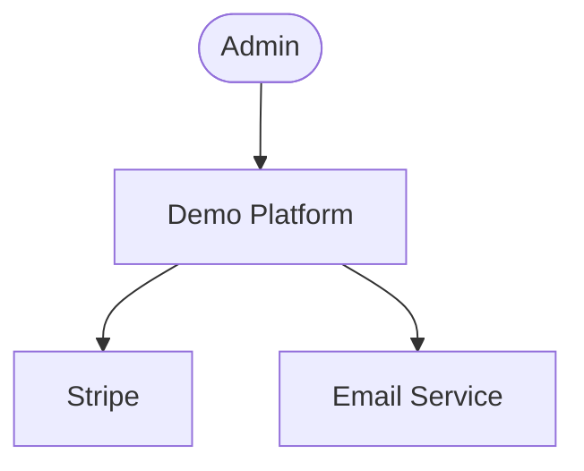

# C4 context — Demo Platform

```mermaid
graph TB
  user([Admin]) --> sys[Demo Platform]
  sys --> pay[Stripe]
  sys --> mail[Email Service]
```

The platform serves a single admin persona; Stripe and the email service are
external systems per the integrations list in answers.yaml.
