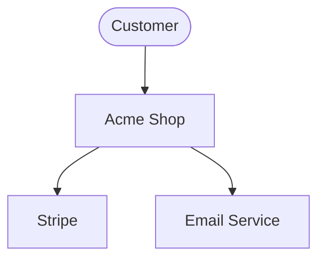
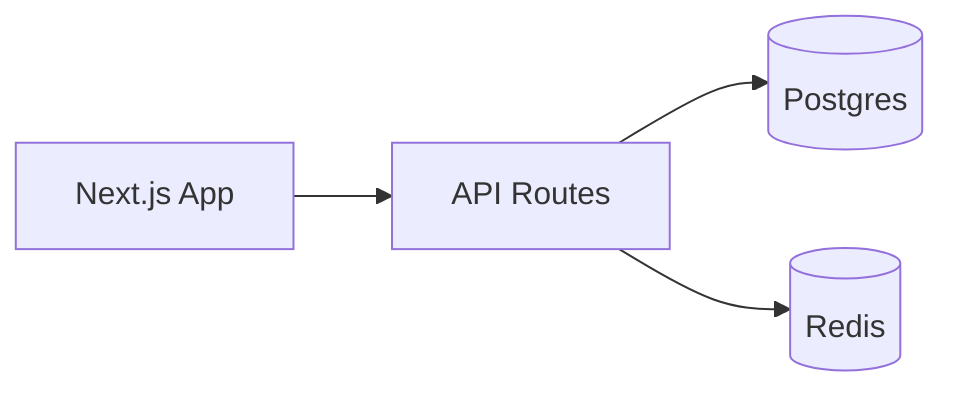
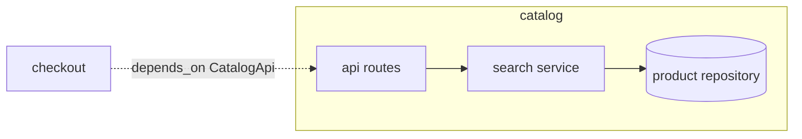
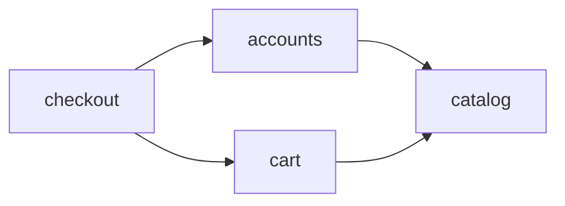

# Artifact templates — copy, fill, never invent structure

## Provenance header (SHOULD on every NEW tasks.yaml / architecture.yaml)

Begin both files with three YAML comment lines. Comments are ignored by every
consumer (skill scripts, VS Code extension, any YAML toolchain), so this is
purely additive metadata — it can never break a parser:

```yaml
# schema_version: 1
# generator: archgen v0.0.4
# generated_at: 2026-08-26T09:00:00.000Z
```

Version token rules — code-defensive, NEVER guess:

1. If a `.archgen-version` stamp sits next to `SKILL.md` (the installed skill
   root) and reads as exact `MAJOR.MINOR.PATCH`, write `generator: archgen vX.Y.Z`.
2. Else if an adjacent `archgen.config.json` carries a semver-shaped
   `"version"` field, use that value the same way.
3. Else omit the version token entirely: plain `# generator: archgen`.

`generated_at` is one ISO-8601 timestamp per generation run (all files written
by the same run share it). Keep the header at the very top of the file; never
place content above it and never encode meaning anywhere except these three
lines.

Older artifacts without the header are backfilled by
`npx archgen-skill migrate --apply` (dry-run `--check` is the default), which
snapshots each file into `.archgen/.backup/<ts>/migrate/` before touching it
and skips already-stamped files, so re-running is always safe.

## Self-containment rules (anti-hallucination)

Artifacts are executed by sessions and sub-agents that were NEVER part of the
conversation that produced them. Hard rules, no exceptions:

1. **Full paths, always.** Every task step, `file_ownership` glob, artifact,
   and verification command uses complete repo-root-relative paths
   (`src/features/catalog/api/routes.ts`), never bare filenames (`routes.ts`)
   and never invented directories. Paths come from `structure:` /
   `owns[]` in architecture.yaml or from surveyed code — nowhere else.
2. **Names derive from naming_conventions.** Every file, symbol, table, and
   env-var name you introduce cites WHICH convention key produced it, e.g.
   `camelCase symbols per naming_conventions.symbol_casing`. If no key covers
   it, add the key first, then use it.
3. **Plans survive context summarization alone.** Any session reading ONLY
   `.archgen/<slug>/` must execute correctly with zero chat history. If a fact
   matters, it is written in an artifact; if it is not written, it does not
   exist.
4. **Forbidden phrases** (in any artifact): "as discussed", "the usual
   pattern", "same as before", "see chat". Replace each with the concrete
   artifact reference it was standing in for.
5. **Cross-references are artifact-relative**, e.g.
   `see ../architecture.yaml data_contracts.orders` or
   `payload per ../architecture.yaml api_contracts.payments.request_payload`.
   Never restate a contract from memory — point at it.
6. **Verifier-compatible ids in plans.** `verify-plan.mjs` rejects any
   UPPERCASE-numbered token in `plans/*.md` that is not a real tasks.yaml id
   (`TASK-999` fails; your actual ids pass). So: requirement ids
   (`FR-<MODULE>-nn`) are cited from `tasks.yaml` acceptance lines and
   `docs/prd.md` itself; inside plan prose link the anchor instead —
   `../docs/prd.md#fr-catalog-01`. Every tasks.yaml id MUST appear in some
   plan file (coverage check runs both directions).

## Plan depth by scope class

Pick ONE class before writing any artifact; depth scales with risk, not
enthusiasm. Misclassifying is a defect: inflating SMALL wastes tokens,
shrinking LARGE hallucinates.

- **SMALL** (add/touch few things): lean plan-note shape stays —

  ```markdown
  # <feature> — plan note (SMALL)
  Intent: <one paragraph>
  Tasks: see tasks.yaml entries <ids>
  Risks: <bullets or none>
  ```

  Every task entry STILL carries absolute-from-repo-root paths verbatim —
  in `file_ownership`, in each step, in verification commands. No Context
  section, no diagrams, no PRD.

- **MEDIUM**: `plans/<feature>.md` gains, in order:
  - **Context** — 2–4 paragraphs max: why now, what exists, what changes.
  - **Per-task sections** (one `<id> — <title>` heading per task):
    Approach (short bullets) + **Edge cases** (min 3 bullets each, feeding
    the edge-case matrix below) + **Out-of-scope** (explicit non-goals).
  - **Verification steps** — ordered, runnable, repo-root-relative.
  No PRD, no diagrams unless structure changed.

- **LARGE / greenfield-from-scratch**: FULL professional stack — PRD
  (`docs/prd.md`, ~1 page per major module) + expanded `architecture.yaml`
  (naming_conventions, data_contracts, api_contracts, environment_matrix) +
  per-task edge-case matrices + per-module diagrams + MEDIUM-grade plan
  sections. Every diagram ≤15 nodes.

## architecture.yaml (LARGE scope)

The four contract blocks below (`naming_conventions`, `data_contracts`,
`api_contracts`, `environment_matrix`) are THE anti-hallucination source of
truth: tasks cite them by key instead of re-describing shapes from memory.
Module entries extend `schemas/architecture-conventions.md` (its
`name`/`responsibility`/`owns[]` trio is unchanged and still normative).

```yaml
name: Acme Shop
slug: acme-shop            # becomes .archgen/acme-shop/
stack:
  language: typescript
  runtime: node20
  framework: nextjs
  database: postgres
structure:                 # planned folder tree — planned BEFORE code exists
  - path: src/features/<feature>/
    purpose: feature modules (api, internal, tests colocated)
  - path: src/shared/
    purpose: cross-feature utilities, no feature imports
  - path: src/config/
    purpose: env parsing + constants
naming_conventions:        # filled during generation; referenced by EVERY task
  file_naming: kebab-case files, feature folder mirrors module name
  dir_layout: "<module>/{api,internal,tests}; shared code only in src/shared/"
  symbol_casing: PascalCase types, camelCase functions, SCREAMING_SNAKE env
  test_placement: colocated <name>.test.ts next to unit under test
modules:
  - name: catalog
    responsibility: product browsing + search
    owns: ["src/features/catalog/**"]
    depends_on_modules: []            # acyclic; drives task depends_on edges
    key_interfaces:                   # what OTHER modules may import — nothing else
      - CatalogApi (src/features/catalog/api/index.ts)
  - name: checkout
    responsibility: cart → payment orchestration
    owns: ["src/features/checkout/**"]
    depends_on_modules: [catalog]
    key_interfaces:
      - CheckoutApi (src/features/checkout/api/index.ts)
data_contracts:           # schemas/entities; field tables, not prose
  orders:
    storage: postgres table orders (migration migrations/NNNN_orders.sql)
    fields:
      - {field: id,         type: uuid,        required: true, notes: pk}
      - {field: session_id, type: uuid,        required: true, notes: fk sessions}
      - {field: total_cents, type: integer,    required: true, notes: >= 0}
      - {field: status,     type: enum(pending,paid,failed), required: true}
      - {field: created_at, type: timestamptz, required: true, notes: db default now()}
api_contracts:            # endpoint/method/auth/payload/error-shape tables
  payments:
    - endpoint: /api/checkout/pay
      method: POST
      auth: session cookie; 401 when absent
      request_payload: {order_id: uuid}
      success: 200 {payment_id: uuid, status: paid}
      error_shape: {code: string, message: string, retryable: boolean}
environment_matrix:       # vars per env; unparsed vars fail fast in src/config/
  - {var: DATABASE_URL, dev: local docker postgres, ci: ephemeral service, prod: secret ref, required: true}
  - {var: PAYMENT_API_KEY, dev: stub key, ci: stub key, prod: secret ref, required: true}
decisions:                 # ADR-lite; full ADRs live in decisions/
  - id: D1
    title: Postgres over MongoDB
    context: transactional orders + reporting queries
    decision: Postgres 16 with Prisma
    consequences: schema migrations required per release
```

Token balance: one contract block per module/domain (~10–20 lines each);
split further rather than letting any single block exceed ~40 lines.

## Product requirements document (PRD) — LARGE/greenfield

Written to `docs/prd.md` BEFORE tasks.yaml. Bullet-dense prose, zero filler
paragraphs; target ~1 page per major module. Requirement ids here are the
stable handles every task acceptance cites.

```markdown
# PRD — <project name>

## Problem statement & goals
- <pain, quantified where possible>
- Goals: <3–5 outcome bullets, each measurable>

## Non-goals
- <explicitly out; prevents scope creep mid-execution>

## Personas / stakeholders
- <persona>: <need>, <success looks like>

## Functional requirements — <module-name>   (repeat per module)
- FR-<MODULE>-01: <single verifiable behavior statement>
- FR-<MODULE>-02: ...
<!-- ids are immutable once tasks reference them -->

## Non-functional requirements (measurable targets, no adjectives)
- Perf: p95 API latency < 300 ms at 50 rps; LCP < 2.5 s
- Security: authz check on every endpoint; no secrets in repo; OWASP top-10 reviewed
- i18n: all user-facing strings externalized; ICU plurals; RTL-safe layouts
- A11y: WCAG 2.1 AA; full keyboard nav; contrast ≥ 4.5:1

## Success metrics
- <metric>: <baseline> → <target> within <window>

## Risks & mitigations
- <risk> → <mitigation>, <owner task id or ADR ref>

## Open questions
- <question> — owner <name/role>, blocks <task id | none>
```

## tasks.yaml (canonical shape)

```yaml
# comment lines are preserved by set-status.mjs — annotate freely
tasks:
  # Core pipeline — do first
  - id: C
    title: Scaffold project skeleton + config loading
    depends_on: []
    file_ownership: ["src/config/**", "package.json"]   # FULL repo-root-relative paths, never bare filenames
    acceptance:
      - "npm run build exits 0"
      - "config loads from env with typed schema"
  - id: B
    title: Catalog API endpoints
    depends_on: [C]
    file_ownership: ["src/features/catalog/**"]
    acceptance:
      - "GET /products returns seeded list"
  - id: A
    title: Checkout flow wired to catalog
    depends_on: [B]
    parallel_group: wave-final
    file_ownership: ["src/features/checkout/**"]
    artifacts: ["docs/checkout-flow.md"]
    acceptance:
      - "e2e test completes purchase with stub payment"
```

Rules encoded above: depends_on = prerequisites; ownership globs disjoint
within a wave; acceptance = objectively checkable statements. Acceptance
bullets SHOULD reference edge-matrix rows (`E1`–`En` of that task's matrix)
and, on LARGE, the FR ids they implement. Schema stays stable
(`schemas/tasks.schema.json`, schema_version 1) — no new required fields;
guidance lives in comments and plan files.

LARGE-grade example task (same schema, richer acceptance — sits beside the
minimal ones above, never replaces them):

```yaml
  - id: PAY-2
    title: Order payment capture with retry
    depends_on: [A]
    parallel_group: wave-payments
    file_ownership:
      - src/features/checkout/internal/capture.ts       # full path per naming_conventions.dir_layout
      - src/features/checkout/internal/capture.test.ts  # colocated per naming_conventions.test_placement
    artifacts: ["docs/payment-retry.md"]
    acceptance:
      - "capture() sends idempotency key; double submit charges once (E3)"
      - "gateway 5xx retries 3x exponential backoff, then raises PaymentFailed (E5)"
      - "denied card → 402 with error_shape from ../architecture.yaml api_contracts.payments (FR-PAYMENTS-02)"
      - "amounts render via session locale, cents-safe integer math (E6)"
```

## Edge-case matrix (per task, MEDIUM+)

Each MEDIUM/LARGE task carries a matrix in its plan section. Every row MUST
map to an acceptance bullet — no orphan rows; every acceptance bullet SHOULD
trace to ≥1 row. Minimum coverage classes per task: empty/null, boundary
values, authz denied, concurrent/conflicting write, failure/retry path,
i18n/formatting edge. Tasks touching infra (migrations, deploys, queues)
ADD: partial-failure recovery, rollback story.

```markdown
| Case | Input/state                     | Expected behavior                    | Covered by |
| ---- | ------------------------------- | ------------------------------------ | ---------- |
| E1   | empty/null: cart with 0 items   | 200, total 0, no gateway call        | PAY-2#1    |
| E2   | boundary: qty = max allowed 999 | accepted; 1000 rejected with 422     | PAY-2#1    |
| E3   | concurrent: same order paid 2x  | idempotency key → single charge      | PAY-2#1    |
| E4   | authz denied: expired session   | 401 error_shape, no state change     | PAY-2#2    |
| E5   | failure/retry: gateway 5xx x3   | backoff retry then PaymentFailed     | PAY-2#2    |
| E6   | i18n: locale de-DE, ¥-less cur  | EUR formatting, correct decimal comma| PAY-2#3    |
```

`Covered by` = `<task-id>#<acceptance index>` (1-based, matching the
tasks.yaml `acceptance` array). Rows are additive across waves; keep each
matrix ≤10 rows — split into per-concern tables beyond that.

## ADR template (decisions/NNNN-title.md)

```markdown
# NNNN. <decision title>
Date: YYYY-MM-DD · Status: accepted
## Context
<forces at play>
## Decision
<what we chose>
## Consequences
<positive / negative / neutral>
```

## Mermaid snippets

C4 context:


Container:


## Per-module diagram (LARGE)

For EACH `modules:` entry in architecture.yaml, one small flowchart of its
internal components plus its `depends_on_modules` edges (arrow points from
consumer to provider). Plus ONE integration diagram wiring all modules —
edges between modules only, no internals. HARD LIMIT: ≤15 nodes per diagram;
split into two diagrams rather than cramming. Internals stay ≤6 nodes per
module.

Catalog module (internal + inbound depends_on edge):



Integration (modules as atoms, mirrors depends_on_modules):


