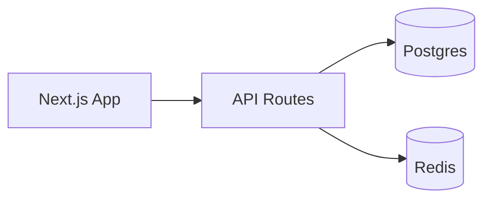

# Artifact templates — copy, fill, never invent structure

## Provenance header (SHOULD on every NEW tasks.yaml / architecture.yaml)

Begin both files with three YAML comment lines. Comments are ignored by every
consumer (skill scripts, VS Code extension, any YAML toolchain), so this is
purely additive metadata — it can never break a parser:

```yaml
# schema_version: 1
# generator: archgen v0.0.4
# generated_at: 2026-08-26T09:00:00.000Z
```

Version token rules — code-defensive, NEVER guess:

1. If a `.archgen-version` stamp sits next to `SKILL.md` (the installed skill
   root) and reads as exact `MAJOR.MINOR.PATCH`, write `generator: archgen vX.Y.Z`.
2. Else if an adjacent `archgen.config.json` carries a semver-shaped
   `"version"` field, use that value the same way.
3. Else omit the version token entirely: plain `# generator: archgen`.

`generated_at` is one ISO-8601 timestamp per generation run (all files written
by the same run share it). Keep the header at the very top of the file; never
place content above it and never encode meaning anywhere except these three
lines.

Older artifacts without the header are backfilled by
`npx archgen-skill migrate --apply` (dry-run `--check` is the default), which
snapshots each file into `.archgen/.backup/<ts>/migrate/` before touching it
and skips already-stamped files, so re-running is always safe.

## architecture.yaml (LARGE scope)

```yaml
name: Acme Shop
slug: acme-shop            # becomes .archgen/acme-shop/
stack:
  language: typescript
  runtime: node20
  framework: nextjs
  database: postgres
structure:                 # planned folder tree — planned BEFORE code exists
  - path: src/features/<feature>/
    purpose: feature modules (api, internal, tests colocated)
  - path: src/shared/
    purpose: cross-feature utilities, no feature imports
  - path: src/config/
    purpose: env parsing + constants
modules:
  - name: catalog
    responsibility: product browsing + search
    owns: ["src/features/catalog/**"]
  - name: checkout
    responsibility: cart → payment orchestration
    owns: ["src/features/checkout/**"]
decisions:                 # ADR-lite; full ADRs live in decisions/
  - id: D1
    title: Postgres over MongoDB
    context: transactional orders + reporting queries
    decision: Postgres 16 with Prisma
    consequences: schema migrations required per release
```

## tasks.yaml (canonical shape)

```yaml
# comment lines are preserved by set-status.mjs — annotate freely
tasks:
  # Core pipeline — do first
  - id: C
    title: Scaffold project skeleton + config loading
    depends_on: []
    file_ownership: ["src/config/**", "package.json"]
    acceptance:
      - "npm run build exits 0"
      - "config loads from env with typed schema"
  - id: B
    title: Catalog API endpoints
    depends_on: [C]
    file_ownership: ["src/features/catalog/**"]
    acceptance:
      - "GET /products returns seeded list"
  - id: A
    title: Checkout flow wired to catalog
    depends_on: [B]
    parallel_group: wave-final
    file_ownership: ["src/features/checkout/**"]
    artifacts: ["docs/checkout-flow.md"]
    acceptance:
      - "e2e test completes purchase with stub payment"
```

Rules encoded above: depends_on = prerequisites; ownership globs disjoint
within a wave; acceptance = objectively checkable statements.

## SMALL-scope plan note (plans/<feature>.md)

```markdown
# <feature> — plan note (SMALL)
Intent: <one paragraph>
Tasks: see tasks.yaml entries <ids>
Risks: <bullets or none>
```

## ADR template (decisions/NNNN-title.md)

```markdown
# NNNN. <decision title>
Date: YYYY-MM-DD · Status: accepted
## Context
<forces at play>
## Decision
<what we chose>
## Consequences
<positive / negative / neutral>
```

## Mermaid snippets

C4 context:


Container:

